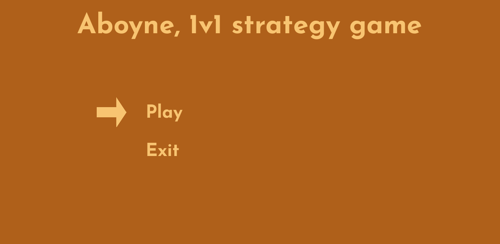
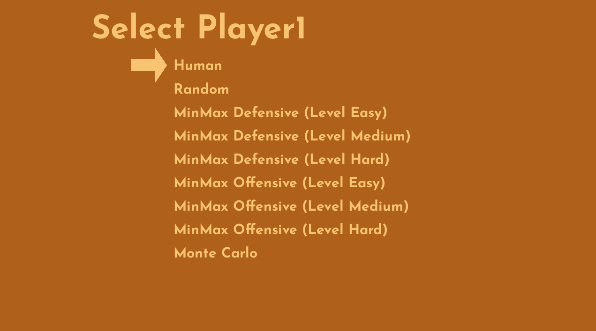
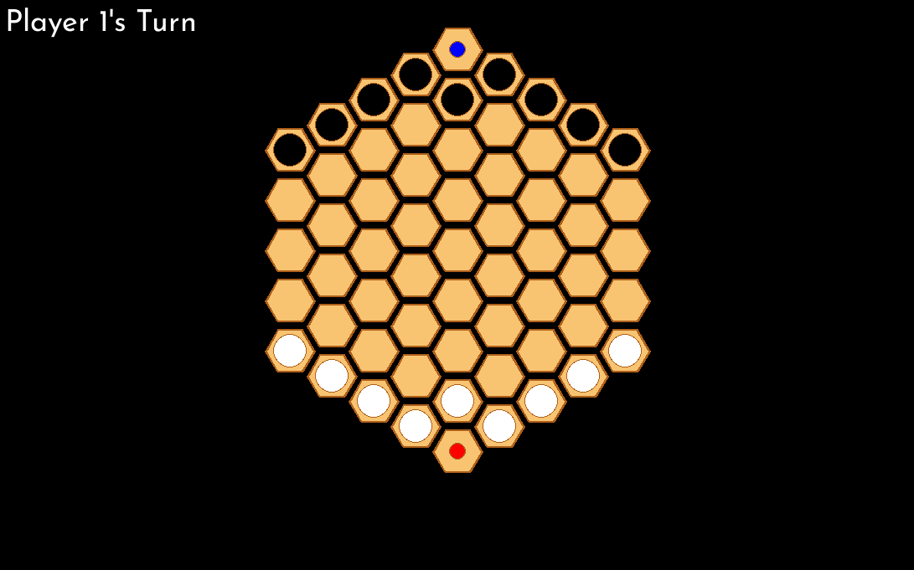
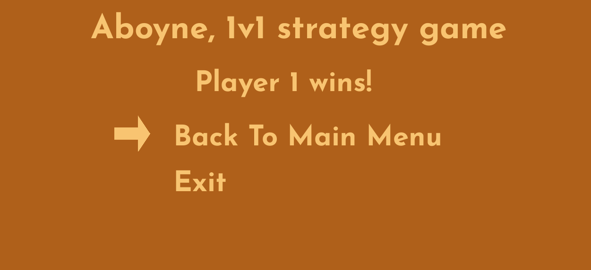

# Artificial Intelligence Project 1 - Aboyne (Grade: 18.5)

The selected topic for this project was Adversarial Search Methods for Two-Player Board Games.

The selected problem was the Aboyne Board Game.

# Dependencies
The project was done using Python 3.11.8

Additionally, to execute the program via python script, the following dependencies need to be installed in a python environment:
```
pygame == 2.5.2
numpy
```
If pip is available the dependencies can be installed with the command:
```
pip install -r requirements.txt
```

# Execution
To play the game simply run the script main.py that is located in the root of the project.
```
python3 main.py
```

# Project Structure

- **bots -** aspects related to the algorithms of MiniMax
- **monte_carlo -** aspects related to the algorithm of Monte Carlo Search Tree
- **display -** everything related to the graphics of the game
- **game -** aspects related the data of the game and function related to the behaviour of the game
- **main -** main file to be executed.


# How to play

## Main Menu
In the main menu the user can select the type of player that Player 1 and Player 2 will be and start the game.




## Play
The user might choose movements of his pieces by clicking on the piece he wants to move and then select one of the available moves that are displayed in the game board. The game finishes when the player reaches his goal cell or has no more pieces available to move because they were captured by the other player or are blocked by the other player's pieces.



## End Game Menu
In the end game menu the user can select the option to go back to the main menu or leave the game.



# Group Members

André dos Santos Faria Relva - up202108695 \
Pedro Guilherme Pinto Magalhães - up202108756 \
Rafael Azevedo Alves - up202004476
